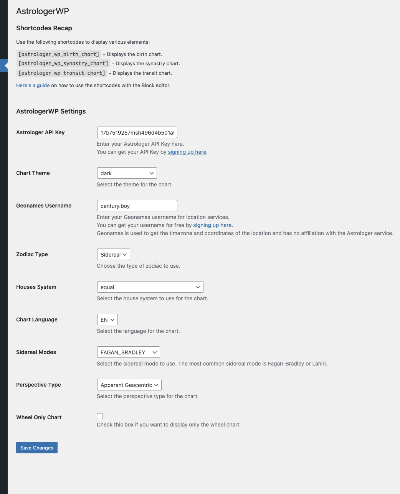

# AstrologerWP

The official WordPress plugin for the [Astrologer API](https://rapidapi.com/gbattaglia/api/astrologer) on RapidAPI.
Generate professional astrology charts, synastry analysis, transits, solar/lunar returns, moon phases, and more — directly in WordPress.




---

## Table of Contents

- [Features](#features)
- [Quick Start (WordPress Users)](#quick-start-wordpress-users)
- [Development & Testing](#development--testing)
  - [Prerequisites](#prerequisites)
  - [Option A: Docker Compose](#option-a-docker-compose)
  - [Option B: Apple Container (macOS)](#option-b-apple-container-macos)
  - [Testing Against a Local API](#testing-against-a-local-api)
  - [Building Assets](#building-assets)
- [Shortcodes Reference](#shortcodes-reference)
- [Configuration Reference](#configuration-reference)
  - [API Credentials](#api-credentials)
  - [Chart Calculation](#chart-calculation)
  - [Chart Rendering](#chart-rendering)
  - [Chart Display Options](#chart-display-options)
- [Architecture](#architecture)
- [Creating a Distribution ZIP](#creating-a-distribution-zip)
- [License](#license)

---

## Features

**8 Chart Types:**

| Shortcode | Chart Type | Description |
|---|---|---|
| `[astrologer_wp_birth_chart]` | Natal | Birth chart with planetary positions, aspects, houses |
| `[astrologer_wp_synastry_chart]` | Synastry | Relationship compatibility between two people |
| `[astrologer_wp_transit_chart]` | Transit | Planetary transits against a natal chart |
| `[astrologer_wp_composite_chart]` | Composite | Midpoint composite chart for relationships |
| `[astrologer_wp_solar_return_chart]` | Solar Return | Yearly solar return with optional relocation |
| `[astrologer_wp_lunar_return_chart]` | Lunar Return | Monthly lunar return with optional relocation |
| `[astrologer_wp_moon_phase]` | Moon Phase | Illumination, upcoming phases, eclipses |
| `[astrologer_wp_now_chart]` | Current Sky | Real-time chart at UTC/Greenwich |

**Rendering Options:**

- 6 themes: `classic`, `light`, `dark`, `dark-high-contrast`, `strawberry`, `black-and-white`
- 2 styles: `classic` (traditional wheel), `modern` (concentric rings)
- Split chart mode (separate wheel + aspect grid SVGs)
- Transparent background
- Configurable display elements (degree indicators, aspect icons, zodiac ring, etc.)

**Astrology Configuration:**

- 24 house systems (Placidus, Koch, Whole Sign, etc.)
- Tropical & Sidereal zodiac (21 ayanamsha modes including custom USER)
- 4 perspectives (Apparent Geocentric, Heliocentric, Topocentric, True Geocentric)
- 10 chart languages (EN, FR, PT, IT, CN, ES, RU, TR, DE, HI)
- Relationship scoring for synastry charts

**UX:**

- City autocomplete with timezone resolution via Geonames
- Dark & light frontend themes
- Fully responsive SVG charts
- WordPress security best practices (nonce, sanitization, escaping)

---

## Quick Start (WordPress Users)

1. Download the plugin ZIP from [Releases](https://github.com/g-battaglia/AstrologerWP/releases) or build it with `./compress_4_wp.sh`
2. Upload to WordPress via **Plugins > Add New > Upload Plugin**
3. Activate **AstrologerWP**
4. Go to **AstrologerWP** in the admin menu
5. Enter your **Astrologer API Key** — get one at [RapidAPI](https://rapidapi.com/gbattaglia/api/astrologer/pricing)
6. Enter your **Geonames Username** — free at [geonames.org](http://www.geonames.org/login)
7. Configure chart preferences (theme, language, house system, etc.)
8. Add any shortcode to a page or post, e.g. `[astrologer_wp_birth_chart]`

---

## Development & Testing

### Prerequisites

- **Node.js** (for building JS/CSS assets)
- **Docker** or **macOS with Apple Container CLI** (for the test WordPress environment)
- An **Astrologer API key** from [RapidAPI](https://rapidapi.com/gbattaglia/api/astrologer/pricing)
- A **Geonames username** from [geonames.org](http://www.geonames.org/login)

### Environment Setup

```bash
# Clone the repo
git clone https://github.com/g-battaglia/AstrologerWP.git
cd AstrologerWP

# Install Node dependencies (for asset building)
npm install

# Create your environment file
cp .env.example .env
```

Edit `.env` with your credentials:

```env
ASTROLOGER_API_KEY=your_rapidapi_key_here
GEONAMES_USERNAME=your_geonames_username

# Optional: point to a local API for testing
# ASTROLOGER_WP_API_BASE_URL=http://host.docker.internal:8000
```

### Option A: Docker Compose

Best for Linux or users with Docker Desktop installed.

```bash
# Start WordPress + MariaDB
make up

# Auto-configure WordPress (install, activate plugin, create test pages)
make setup

# Open in browser
open http://localhost:8080
```

Or without Make:

```bash
docker compose up -d
docker compose exec wordpress setup-wordpress.sh
```

**Useful commands:**

```bash
make logs       # Tail WordPress logs
make shell      # Open a bash shell in the WordPress container
make down       # Stop containers (keeps data)
make clean      # Stop containers and delete all data
make rebuild    # Rebuild the WordPress image and restart
```

### Option B: Apple Container (macOS)

Native macOS containers, no Docker Desktop required. Requires macOS 26+ with `container` CLI.

```bash
# Start everything (builds image, creates network, starts MariaDB + WordPress, configures)
make container-up

# Or directly:
./container-run.sh

# With inline options:
./container-run.sh --api-key YOUR_KEY --geonames-user YOUR_USER --api-url http://host.internal:8000
```

**Useful commands:**

```bash
make container-logs     # Tail WordPress logs
make container-shell    # Open a bash shell
make container-down     # Stop (keeps data)
make container-clean    # Stop and purge all data
```

### What the Setup Creates

After running `make setup` or `./container-run.sh`, you get a fully configured WordPress with:

- **Admin panel:** http://localhost:8080/wp-admin/ (admin / admin)
- **Plugin activated** with your API keys pre-configured
- **8 test pages**, one for each shortcode:

| URL | Shortcode |
|---|---|
| `/birth-chart/` | `[astrologer_wp_birth_chart]` |
| `/synastry-chart/` | `[astrologer_wp_synastry_chart]` |
| `/transit-chart/` | `[astrologer_wp_transit_chart]` |
| `/composite-chart/` | `[astrologer_wp_composite_chart]` |
| `/solar-return/` | `[astrologer_wp_solar_return_chart]` |
| `/lunar-return/` | `[astrologer_wp_lunar_return_chart]` |
| `/moon-phase/` | `[astrologer_wp_moon_phase]` |
| `/current-sky/` | `[astrologer_wp_now_chart]` |

### Testing Against a Local API

To test against a local instance of the Astrologer API instead of the production RapidAPI endpoint:

**1. Set the environment variable:**

```env
# In .env:
# Docker uses host.docker.internal, Apple Container uses host.internal
ASTROLOGER_WP_API_BASE_URL=http://host.docker.internal:8000   # Docker
ASTROLOGER_WP_API_BASE_URL=http://host.internal:8000           # Apple Container
```

**2. Or pass it inline:**

```bash
# Docker
ASTROLOGER_WP_API_BASE_URL=http://host.docker.internal:8000 docker compose up -d

# Apple Container
./container-run.sh --api-url http://host.internal:8000
```

**3. Or set it from the WordPress admin panel:**

Go to **AstrologerWP > API Base URL (Advanced)** and enter your local URL.

When a custom endpoint is set, RapidAPI-specific headers (`x-rapidapi-host`) are omitted — only the API key is sent as `x-rapidapi-key`. If your local API runs in debug mode, authentication is bypassed entirely.

### Building Assets

The plugin uses **esbuild** for JavaScript and **Sass** for CSS.

```bash
# Production build
make build
# or: npm run build

# Development mode (watch for changes)
npm run dev
```

Built files go to `assets/dist/`.

---

## Shortcodes Reference

### Birth Chart

```
[astrologer_wp_birth_chart]
```

Form fields: name, date/time, city (with autocomplete).
Generates a natal chart SVG with planetary positions, aspects, houses, element and quality distribution.

### Synastry Chart

```
[astrologer_wp_synastry_chart]
```

Two-person form (Partner A + Partner B).
Generates a dual-wheel chart showing planetary interactions between two natal charts. Includes relationship scoring.

### Transit Chart

```
[astrologer_wp_transit_chart]
```

Form fields: subject birth data + transit date/time/city.
Shows how current (or selected) planetary positions affect the natal chart.

### Composite Chart

```
[astrologer_wp_composite_chart]
```

Two-person form (Person A + Person B).
Creates a midpoint chart representing the relationship itself (not how two people interact, but what the relationship _is_).

### Solar Return Chart

```
[astrologer_wp_solar_return_chart]
```

Form fields: birth data + return year + optional return location.
Calculates the exact moment the Sun returns to its natal position for the given year. Optionally relocated to a different city.

### Lunar Return Chart

```
[astrologer_wp_lunar_return_chart]
```

Form fields: birth data + return year/month + optional return location.
Same concept as solar return, but for the Moon (monthly cycle).

### Moon Phase

```
[astrologer_wp_moon_phase]
```

Form fields: date/time + city.
Displays: phase name, illumination %, stage, moon age, next new/full moon, sunrise/sunset, upcoming eclipses.

### Current Sky

```
[astrologer_wp_now_chart]
```

No form needed — generates a chart for the current moment at UTC/Greenwich on page load.

---

## Configuration Reference

All settings are configured from **WordPress Admin > AstrologerWP**.

### API Credentials

| Setting | Description |
|---|---|
| **Astrologer API Key** | Your RapidAPI subscription key. [Get one here](https://rapidapi.com/gbattaglia/api/astrologer/pricing). |
| **Geonames Username** | Free username for city/timezone lookup. [Register here](http://www.geonames.org/login). |
| **API Base URL** | Advanced. Override the API endpoint for local testing. Leave empty for production (RapidAPI). Can also be set via `ASTROLOGER_WP_API_BASE_URL` environment variable. |

### Chart Calculation

| Setting | Options | Default |
|---|---|---|
| **Zodiac Type** | `Tropical`, `Sidereal` | Tropical |
| **Sidereal Mode** | 21 modes (FAGAN_BRADLEY, LAHIRI, DELUCE, RAMAN, USER, etc.) | _(only when Sidereal)_ |
| **Houses System** | 24 systems: `P` Placidus, `K` Koch, `W` Whole Sign, `C` Campanus, `R` Regiomontanus, etc. | P (Placidus) |
| **Chart Language** | EN, FR, PT, IT, CN, ES, RU, TR, DE, HI | EN |
| **Perspective Type** | Apparent Geocentric, Heliocentric, Topocentric, True Geocentric | Apparent Geocentric |

### Chart Rendering

| Setting | Type | Default | Description |
|---|---|---|---|
| **Chart Theme** | Select | classic | Visual theme: classic, light, dark, dark-high-contrast, strawberry, black-and-white |
| **Chart Style** | Select | classic | classic = traditional wheel, modern = concentric rings |
| **Wheel Only** | Checkbox | off | Show only the wheel without the aspect grid |
| **Split Chart** | Checkbox | off | Render wheel and grid as separate SVGs, stacked vertically |
| **Transparent Background** | Checkbox | off | Transparent instead of theme background color |
| **Aspect Grid Type** | Select | list | For dual charts: `list` (vertical) or `table` (grid matrix) |

### Chart Display Options

| Setting | Type | Default | Description |
|---|---|---|---|
| **Show House Position Comparison** | Checkbox | on | House comparison table next to the wheel |
| **Show Cusp Position Comparison** | Checkbox | on | Cusp comparison table (dual charts only) |
| **Show Degree Indicators** | Checkbox | on | Radial lines and degree numbers for planet positions |
| **Show Aspect Icons** | Checkbox | on | Aspect symbols on wheel aspect lines |
| **Show Zodiac Background Ring** | Checkbox | on | Colored zodiac wedges (modern style only) |

---

## Architecture

```
astrologerwp/
├── astrologer_wp.php                 # Main plugin entry point
├── includes/
│   ├── admin/
│   │   └── settings.php              # Admin panel, settings registration
│   ├── utils/
│   │   ├── AstrologerApiAdapter.php  # API v5 client (all endpoints + rendering params)
│   │   ├── GeonamesAdapter.php       # City search + timezone resolution (cached)
│   │   ├── KerykeionConstants.php    # All astrology constants and enums
│   │   ├── Subject.php               # Birth data model
│   │   └── chart-renderer.php        # Shared SVG rendering (handles split/wheel-only)
│   ├── shortcodes/                   # 8 shortcode files
│   ├── ajax-handlers.php             # AJAX endpoint for city autocomplete
│   ├── enqueue-scripts.php           # JS/CSS asset registration
│   └── functions.php                 # Dark theme body class
├── assets/
│   ├── src/
│   │   ├── js/
│   │   │   ├── frontend.js           # City autocomplete for all forms
│   │   │   └── admin.js              # Sidereal mode toggle, shortcode copy
│   │   └── scss/                     # Sass sources (Bootstrap subset + custom)
│   └── dist/                         # Compiled JS/CSS (committed)
├── docker/                           # Docker test environment
│   ├── Dockerfile
│   └── setup-wordpress.sh            # Auto-configuration script
├── docker-compose.yml                # Docker Compose for testing
├── container-run.sh                  # Apple Container setup script
├── container-stop.sh                 # Apple Container teardown script
├── .env.example                      # Environment template
├── Makefile                          # Convenience commands
├── esbuild.config.mjs               # JS bundler config
├── package.json                      # Node dependencies + build scripts
├── compress_4_wp.sh                  # Creates distribution ZIP
├── readme.txt                        # WordPress.org plugin readme
└── README.md                         # This file
```

**API Flow:**

1. User fills form in shortcode frontend
2. Form submits via GET with nonce
3. Shortcode PHP builds `Subject` objects from sanitized input
4. `AstrologerApiAdapter` sends POST to Astrologer API v5 with subject data + rendering params from WP settings
5. API returns SVG chart + `chart_data` JSON
6. `chart-renderer.php` encodes SVG to base64, outputs to DOM
7. Client-side JS decodes and injects SVG; chart data is available as `window.astrologer*Data`

---

## Creating a Distribution ZIP

To create a clean ZIP for WordPress upload:

```bash
make zip
# or: ./compress_4_wp.sh
```

This excludes development files (.git, node_modules, Docker files, build configs, etc.) and creates `AstrologerWP.zip`.

---

## License

GPLv2 or later. See [LICENSE](LICENSE).

**Author:** [Giacomo Battaglia](https://www.kerykeion.net/) (giacomo@kerykeion.net)
**API:** [Astrologer API on RapidAPI](https://rapidapi.com/gbattaglia/api/astrologer)
**Astrology Engine:** [Kerykeion](https://github.com/g-battaglia/kerykeion)
